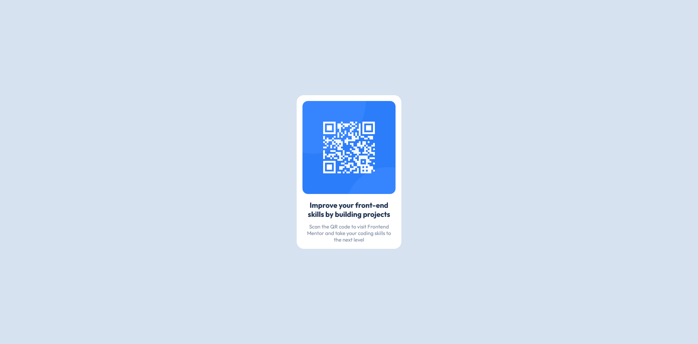

# Frontend Mentor - QR code component solution

This is a solution to the [QR code component challenge on Frontend Mentor](https://www.frontendmentor.io/challenges/qr-code-component-iux_sIO_H). Frontend Mentor challenges help you improve your coding skills by building realistic projects. 

## Table of contents

- [Overview](#overview)
  - [Screenshot](#screenshot)
  - [Links](#links)
- [My process](#my-process)
  - [Built with](#built-with)
  - [What I learned](#what-i-learned)
  - [Continued development](#continued-development)

**Note: Delete this note and update the table of contents based on what sections you keep.**

## Overview

### Screenshot



### Links

- Solution URL: [https://github.com/devaramnye/qr-code-component-challange]
- Live Site URL: [https://devaramnye.github.io/qr-code-component-challange/]

## My process

### Built with

- Semantic HTML5 markup
- CSS custom properties
- Mobile-first workflow

### What I learned

I learned today that I should avoid settings heights in my CSS as it loses responsivness. I tryed to start with Mobile-first workFlow but I still have some issues understanding if my current work is really Mobile-first workFlow


```html
<body>
  <div class="block">
    <div class="content">
      
      <h1>Improve your front-end skills by building projects</h1>
      <p>Scan the QR code to visit Frontend Mentor and take your coding skills to the next level</p>
    </div>
  </div>
</body>
```
```css
* { box-sizing: border-box; }

body {
    margin: 0;
    background: hsl(212, 45%, 89%);
    font-family: Outfit;
}

.block {
    width: 375px;
    margin: 0 auto;
    background: hsl(0, 0%, 100%);
    padding: 1rem;
    border-radius: 15px;
}

.content > img {
    width: 100%;
    border-radius: 15px;
}

.content > h1, p {
    text-align: center;
}

.content > p {
    font-size: 15px;
    color:  hsl(220, 15%, 55%);
}
```
```js
const proudOfThisFunc = () => {
  console.log('🎉')
}
```

### Continued development

I am currently working on responsive coding. Currently doing the 21 challange from Kevinpowell. Day one started (03.08.2023) and already day one helped me extremly by understanding that CSS is responsive by default and we are mainly causing the problems of the responsive threatment of CSS.

### Useful resources

- [Example resource 1](https://www.example.com) - This helped me for XYZ reason. I really liked this pattern and will use it going forward.
- [Example resource 2](https://www.example.com) - This is an amazing article which helped me finally understand XYZ. I'd recommend it to anyone still learning this concept.

**Note: Delete this note and replace the list above with resources that helped you during the challenge. These could come in handy for anyone viewing your solution or for yourself when you look back on this project in the future.**
